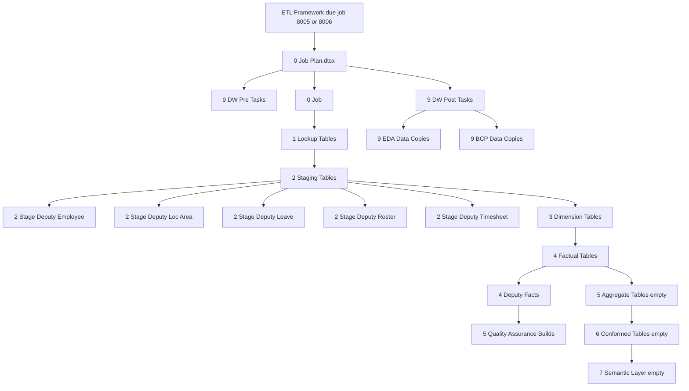

# DPDISSIS Process Draft

## Runtime Flow

1. The ETL Framework SQL Agent job runs on its framework cadence.
2. Framework creates a `metadata.CTL_RUN` run instance and assigns a `RUN_CODE`.
3. Framework reads `metadata.CTL_JOB_CONFIG` for due loads where `JOB_DATE_KICK_OFF` is before current date.
4. Framework evaluates each load status:
   - `READY` or `WAITING`: check dependencies and execute if clear.
   - `IN PROGRESS`: check SSISDB execution state and mark completed/failed as applicable.
   - `FAILED`: apply error handling thresholds.
   - `ERROR`, `DISABLE`, `PAUSED`: do not execute.
5. For DPDISSIS, framework job codes are `8005` (Delta) and `8006` (Fixed).
6. Framework injects `ETL_VAR_*` parameters and custom variables from `metadata.CTL_JOB_CONFIG_VARIABLES`.
7. Framework executes `0 Job Plan.dtsx` in SSISDB.
8. Package loads lookups, Deputy staging tables, dimensions, facts, QA checks, and fixed-mode post-copy tables.
9. Framework records execution outcome in framework run/job history tables and updates next kick-off/date range according to config.
10. Framework closes the run instance.

## SSIS Package Flow

## Mode Decisions

| Decision | Evidence | Outcome |
|---|---|---|
| `ETL_VAR_DATA_RANGE_MODE == "DELTA"` | Disable expressions in `0 Job Plan.dtsx` and stage packages | Lookup branch PH, employee, loc/area, dimensions, and fixed rebuild tasks are disabled where configured; delta modified-date logic runs. |
| `ETL_VAR_DATA_RANGE_MODE == "FIXED"` | Disable expressions in stage/fact/post packages | Rebuild SQL and post-copy packages run; fixed range uses `ETL_CUS_REBUILD_DATE`. |
| `ETL_VAR_IS_FRAMEWORK_FLAG == false` | `9 DW Pre Tasks` disable expression | Framework-only pre-task container is disabled. |
| Job `8005` depends on `8006` | `CTL_JOB_CONFIG_DEPENDENCIES`, `SUCCESSIVE` | The two jobs should not process concurrently. |

## Status Matrix

| Status | Framework meaning from docs | Action |
|---|---|---|
| `READY` | Active and waiting for `JOB_DATE_KICK_OFF` | Execute when due and dependencies pass. |
| `WAITING` | Waiting on another load | Recheck dependencies on next framework pass. |
| `IN PROGRESS` | Load is currently running | Check SSISDB state, completion, failure, timeout. |
| `FAILED` | Temporary failed state | Apply notification, skip, or error thresholds. |
| `ERROR` | Auto-correct not possible or threshold reached | Do not run until fixed manually. |
| `DISABLE` | Manually disabled | Do not run. |
| `PAUSED` | Present in setup script for `8005`/`8006` | Inferred: do not run until changed to active status; framework docs list `DISABLE` but setup script uses `PAUSED`. |

## Retry and Error Paths

- Load failure sets job status to `FAILED`.
- `ERROR_AFTER_CONS_FAILURE` controls when a failing load is set to `ERROR`.
- `SKIP_AFTER_CONS_FAILURE` controls when the framework skips the load and recalculates `JOB_DATE_KICK_OFF`.
- `NOTIF_AFTER_CONS_FAILURE` and `NOTIF_EMAIL_ADDRESS` control failure notification.
- `FAIL_AFTER_RUNNING_MINS` controls long-running execution kill/fail behavior.
- `NOTIF_AFTER_RUNNING_MINS` controls long-running warning notification.
- Setup script sets `ERROR_AFTER_CONS_FAILURE = 1`, `NOTIF_AFTER_CONS_FAILURE = 1`, `SKIP_AFTER_CONS_FAILURE = 0`, and `FAIL_AFTER_RUNNING_MINS = 60` for jobs `8005` and `8006`.
- Gap: exact variables `ERR_MAX_FAIL` and `ERR_PRIOR_FAIL_COUNT` were requested but not found in package or schema text.

## Event Control Flow

SQL schema contains:

- `eda.ETL_EVENT`
- `eda.ETL_EVENT_VARIABLES`
- `eda.ETL_EVENT_RECENT`
- `eda.UPDATE_EVENT_STATUS`

`eda.UPDATE_EVENT_STATUS` updates `EVENT_STATUS`, `DATE_LAST_MODIFIED`, `EVENT_EXECUTION_ID`, `EVENT_DATE_START`, `EVENT_DATE_END`, and `ETL_RUN_CODE`.

Gap: no package in this SSIS project references `eda.ETL_EVENT`, `eda.ETL_EVENT_VARIABLES`, or `eda.UPDATE_EVENT_STATUS`. Therefore, the event creation trigger and package-level event completion/error path cannot be documented from this repo. Inferred from schema only: events are created externally or by another process, then status can be moved from `NEW` to another status through `eda.UPDATE_EVENT_STATUS`; `EVENT_DATE_END` is set only when `@statusTxt = 'Completed'`.

## Verification Points

- Framework config: `SELECT * FROM metadata.CTL_JOB_CONFIG WHERE JOB_CODE IN (8005,8006)`.
- Framework dependencies: `SELECT * FROM metadata.CTL_JOB_CONFIG_DEPENDENCIES WHERE JOB_DEPENDER_CODE IN (8005,8006) OR JOB_DEPENDEE_CODE IN (8005,8006)`.
- Runtime variables: `SELECT * FROM metadata.CTL_JOB_CONFIG_VARIABLES WHERE JOB_CODE IN (8005,8006)`.
- Staging loads: check row counts in `staging.DEP_*` tables after stage packages.
- Intermediate merges: check `staging.FCT_DEP_ROSTER`, `staging.FCT_DEP_TIMESHEET`, `staging.FCT_DEP_LEAVE`, `staging.FCT_DEP_LEAVELINE`, and `staging.DIM_DEPEMPLOYEEWORKPLACE`.
- DW loads: check `dw.DIM_*` and `dw.FACT_*` modified rows and framework metadata columns.
- QA: check `qa.QualityDwhError`, `qa.QualityDetail`, and whether `qa.ProcessQualityIssues` is intended to run, because calls are commented in package SQL text.
- EDA copies: check `eda.LKP_DEP_Location`, `eda.LKP_DEP_WorkArea`, and `eda.LKP_DEP_LeaveRosterTracker` after fixed post tasks.
