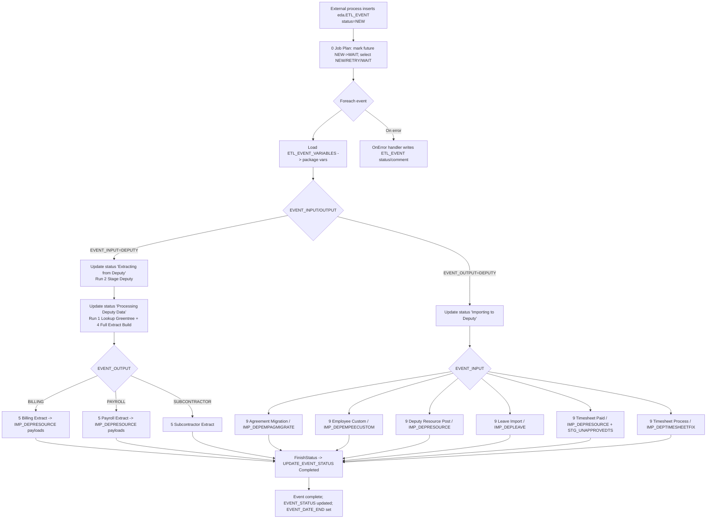

## End-to-End Flow (EDA)
0) **ETL Framework job** (SQL Agent, ~2-minute cadence) creates a run instance (RUN_CODE), checks `metadata.CTL_JOB_CONFIG` for job code 6002, resolves dependencies/parameters, and executes `0 Job Plan.dtsx`.
1) **External trigger** inserts an event into `eda.ETL_EVENT` (ETL_REF=6002) with `EVENT_STATUS='NEW'` (optionally `EVENT_KICKOFF_DATE`) and any required rows in `eda.ETL_EVENT_VARIABLES` (e.g., `EXTRACT_FROM/TO`, `EXTRACT_STAGETYPE`, `EXTRACT_TYPE`).  Typically this will be the Extract Power App or events created automatically from other SSIS packages / Fabric Pipelines.
2) **0 Job Plan.dtsx** starts: updates future-dated `NEW` events to `WAIT`, then selects events with status `NEW/RETRY/WAIT` and kickoff time <= current time into an ADO recordset.
3) **Per-event loop** binds `EVENT_ID`, `EVENT_INPUT`, `EVENT_OUTPUT`, and `EVENT_USER_EMAIL`; a data flow reads `eda.ETL_EVENT_VARIABLES` and pushes values into package variables (date range, extract type, stage type, etc.).
4) **Extract path (EVENT_INPUT = DEPUTY)**:  
   - Call `eda.UPDATE_EVENT_STATUS` → `Extracting from Deputy`; run `2 Stage Deputy.dtsx` to populate `eda.STG_*`.  
   - Call `eda.UPDATE_EVENT_STATUS` → `Processing Deputy Data`; run `4 Full Extract Build.dtsx` (and `1 Lookup Greentree.dtsx`) to build `eda.EXT_DEP_FULL`, `eda.LKP_WorkingDay`, related lookup tables.  
   - **Outbound CSV/queue** based on `EVENT_OUTPUT`:  
     - `BILLING` → `5 Billing Extract.dtsx` generates/emails billing CSV and writes invoice payloads to `eda.IMP_DEPRESOURCE`.  
     - `PAYROLL` → `5 Payroll Extract.dtsx` generates/emails payroll CSV and writes export/paid payloads to `eda.IMP_DEPRESOURCE`.  
     - `SUBCONTRACTOR` → `5 Subcontractor Extract.dtsx` (package handles subcontractor output).
5) **Upload path (EVENT_OUTPUT = DEPUTY)**:  
   - Call `eda.UPDATE_EVENT_STATUS` → `Importing to Deputy`.  
   - Run the package matching `EVENT_INPUT`: `9 Agreement Migration` (IMP_DEPEMPAGMIGRATE), `9 Employee Custom` (IMP_DEPEMPEECUSTOM), `9 Deputy Resource Post` (IMP_DEPRESOURCE), `9 Leave Import` (IMP_DEPLEAVE), `9 Timesheet Paid` (IMP_DEPRESOURCE with STG_UNAPPROVEDTS filter), or `9 Timesheet Process` (IMP_DEPTIMESHEETFIX).
6) **Completion**: `FinishStatus` is set (default `Completed`). `eda.UPDATE_EVENT_STATUS` writes final status, end date, execution id.
7) **Error handler**: On any task failure, optional rollback SQL, metadata lookup, and `Write to ETL_EVENT` append `EVENT_COMMENT` and set status (driven by variables `ERR_FAIL_STATUS`, etc.); optional SMTP email is present but disabled by default.

## Mermaid Flow

## ETL_EVENT Status Lifecycle
| Status | Set By | Notes |
| --- | --- | --- |
| `NEW` | External insert / billing & payroll packages when they create follow-on events | Initial state. |
| `WAIT` | `Get Events to Process` SQL | Assigned to future-dated events until kickoff time reached. |
| `RETRY` | Manual reset or error handler (if configured) | Picked up again by poller. |
| `Extracting from Deputy` | `Event Extracting from Deputy` task (update_event_status) | Start of staging pull. |
| `Processing Deputy Data` | `Event Processing Data` task | Full extract/build in progress. |
| `Importing to Deputy` | `Event Import In Progress` task | Before executing Deputy upload packages. |
| `Completed` (or configured alternative) | `Event Complete` task | Final status; sets `EVENT_DATE_END`. |
| `Error/Retry with comment` | OnError handler `Write to ETL_EVENT` | Appends `EVENT_COMMENT`; status text is driven by handler variables. |

## Decision Points & Routing
- `EVENT_OUTPUT` drives extract CSVs vs. Deputy uploads.
- `EVENT_INPUT` within uploads selects a single downstream package; disable expressions prevent unrelated packages from firing.
- `EVENT_KICKOFF_DATE` dictates when a `NEW` event moves to active processing.  If no date is provied the event moves to acive processing immediately.
- `EXTRACT_STAGETYPE`, `EXTRACT_TYPE`, `EXTRACT_FROM/TO` (from `ETL_EVENT_VARIABLES`) influence extract scope inside staging/full extract logic.  The EDA ETL_EVENT_VARIABLES can be customised so may have different names in other processors.

## Error / Retry Paths
- Any task failure triggers the OnError sequence: rollback SQL runs, metadata lookup, error comment build, update `eda.ETL_EVENT`, optional SMTP email (only sent when run reaches an `ERROR` status).
- Retry vs error is driven by ETL Framework job config (`ERR_MAX_FAIL`, `ERR_PRIOR_FAIL_COUNT`); the handler sets `EVENT_STATUS` to `RETRY` when thresholds allow, otherwise `ERROR`.

## Where to Verify Execution
- Event state: `eda.ETL_EVENT` (`EVENT_STATUS`, `EVENT_DATE_START/END`, `EVENT_COMMENT`, `EVENT_EXECUTION_ID`).
- Event parameters: `eda.ETL_EVENT_VARIABLES` and view `eda.ETL_EVENT_RECENT`.
- Extract results: `eda.EXT_DEP_FULL`, `eda.LKP_WorkingDay`, `eda.LKP_PHTRACKER`.
- Deputy payload queues: `eda.IMP_DEPRESOURCE.responseMsg`, `eda.IMP_DEPEMPEECUSTOM.processOutcome`, `eda.IMP_DEPEMPAGMIGRATE.errorMsg`, `eda.IMP_DEPTIMESHEETFIX.respMessage`, `eda.IMP_DEPLEAVE`.
- Filters for paid events: `eda.STG_UNAPPROVEDTS` used by `9 Timesheet Paid`.
- SSIS logs / catalog reports if deployed to SSISDB; ETLFramework metadata tables for job history if integrated.
- Note data lifetime is limited in `eda` schema tables.
